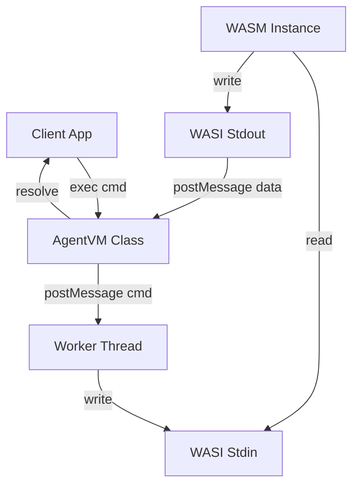

# AgentVM Library Design

## Overview
AgentVM is a lightweight Node.js library to run a WASM-based Linux virtual machine (specifically `agentvm-alpine-python.wasm`) in a persistent state. It allows sending shell commands to the VM and capturing the output, making it suitable for AI agents to use as a sandboxed environment.

### Key Features
- **Networking**: Full TCP/UDP NAT with DHCP and DNS support
- **Host Filesystem Mounts**: Share directories between host and VM
- **Worker Thread Isolation**: Non-blocking execution in separate thread

## Architecture

The library uses Node.js `worker_threads` to isolate the blocking WASM execution loop.



### Components

1.  **`AgentVM` Class (Main Thread)**
    *   Manages the lifecycle of the Worker thread.
    *   Provides `exec(command)` method.
    *   Handles the protocol to detect command completion (using sentinel markers).
    *   Exposes an `on('output', callback)` event or stream for real-time feedback.

2.  **`vm-worker.js` (Worker Thread)**
    *   Imports `node:wasi` and `fs/promises`.
    *   Loads the `.wasm` file.
    *   Implements a custom `stdin` that reads from a message queue populated by the main thread.
    *   Implements a custom `stdout`/`stderr` that sends data back to the main thread.
    *   Starts the WASM instance.

## API Specification

```javascript
class AgentVM {
  /**
   * @param {Object} options
   * @param {string} [options.wasmPath] - Path to the .wasm file
   * @param {Object.<string, string>} [options.mounts] - Mount points mapping VM path to host path
   * @param {boolean} [options.network] - Enable networking (default: true)
   * @param {string} [options.mac] - MAC address for the VM (default: 02:00:00:00:00:01)
   */
  constructor(options) {}

  /**
   * Starts the VM. Resolves when the shell is ready.
   */
  async start() {}

  /**
   * Executes a shell command.
   * @param {string} command
   * @returns {Promise<{stdout: string, stderr: string, exitCode: number}>}
   */
  async exec(command) {}

  /**
   * Terminates the VM.
   */
  async stop() {}
}
```

## Implementation Details

### WASI Polyfill / Streams
Since `node:wasi` expects file descriptors, we will pass a custom object or use a pipe strategy.
A simpler approach for `stdin` in `node:wasi` is to use a `SharedArrayBuffer` or a temporary file, but strictly in-memory is preferred.
However, `node:wasi` in recent versions allows passing custom `input` / `output` streams or handling file descriptors.
We will create a custom implementation of the `fd_read` and `fd_write` syscalls if necessary, or use `WASIOptions` with creating a pipe.

*Strategy*: Use a simple blocking read on `stdin` in the worker. When the main thread sends data, it notifies the worker (possibly via `Atomics.notify` on a SAB if needed, or just checking a buffer in the loop if non-blocking).
*Revised Strategy*: The simplest way with `node:wasi` is to map fd 0, 1, 2 to real pipes or valid file descriptors. However, we want to intercept them.
We might need to monkey-patch or provide a minimal WASI implementation if `node:wasi` is too rigid about using real FDs.
Actually, Node 22 `WASI` constructor takes `stdin`, `stdout`, `stderr` which can be file descriptors. We can use `pipe` from `net` or `fs` to create communication channels.

### Command Delimitation
To treat the continuous shell session as discrete command executions:
1.  User calls `vm.exec("ls -la")`.
2.  Library generates a random token `TOKEN`.
3.  Library writes `ls -la; echo "EXIT_CODE:$?_END:$TOKEN"` to VM stdin.
4.  Library buffers output until it sees `..._END:TOKEN`.
5.  Parses exit code and returns content.

## Dependencies
*   `wasi` (Built-in)
*   `worker_threads` (Built-in)
*   No external npm dependencies.

## Example Usage

```javascript
import { AgentVM } from 'agentvm';

const vm = new AgentVM({ wasmPath: './agentvm-alpine-python.wasm' });
await vm.start();

const result = await vm.exec('python3 -c "print(1+1)"');
console.log(result.stdout); // "2\n"

await vm.stop();
```
